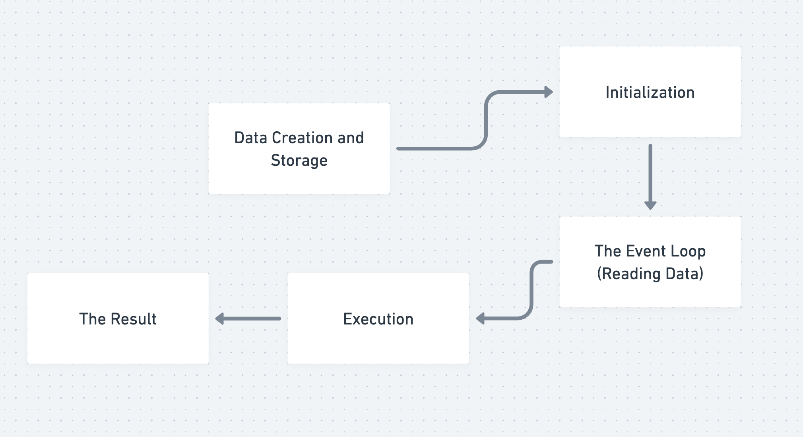

# QuantFlow

A high-performance C++17 statistical arbitrage backtesting engine for pairs trading strategies. Processes tick-level market data using Z-score mean reversion signals to identify and execute profitable trading opportunities with sub-microsecond latency.

## Features

- **High Performance**: Optimized for speed with `-O3` compilation, minimal heap allocations
- **Event-Driven Architecture**: Processes tick data in real-time simulation
- **Statistical Arbitrage**: Z-score based mean-reverting spread strategy
- **Zero Dependencies**: Uses only C++17 Standard Library
- **Comprehensive Analytics**: Sharpe ratio, max drawdown, and PnL tracking

## Technical Specifications

- **Language**: C++17
- **Compiler**: g++ or clang++
- **Build Flags**: `-std=c++17 -Wall -Wextra -Wpedantic -O3`
- **Performance**: Capable of processing millions of ticks per second

## System Architecture

The system follows a high-frequency event loop architecture optimized for low-latency simulation:



1.  **Data Creation & Storage**: Synthetic tick data is generated or loaded from CSV.
2.  **Initialization**: Vectors are pre-allocated and strategy parameters are configured.
3.  **The Event Loop**: The engine iterates through time-series data tick-by-tick.
4.  **Execution**: Signals are generated (Z-score), and portfolio orders are executed immediately based on logic.
5.  **The Result**: Performance metrics (Sharpe, PnL) are calculated upon loop completion.

## Project Structure

```
├── src/
│   ├── TickData.h              # Tick data structure
│   ├── DataReader.h/cpp        # CSV data reader
│   ├── SignalGenerator.h/cpp   # Z-score trading signals
│   ├── PortfolioManager.h/cpp  # Position and PnL management
│   ├── PerformanceCalculator.h/cpp # Analytics and reporting
│   └── main.cpp                # Main backtester application
├── data/
│   └── tick_data.csv           # Market tick data (generated)
├── Makefile                    # Build system
└── generate_data.cpp           # Synthetic data generator
```

## Building

```bash
# Build the backtester
make

# Clean build artifacts
make clean
```

## Usage

### 0. Fetch Real Market Data (optional)

```bash
python fetch_real_data.py
```

Configure `fetch_real_data.py` with your Twelve Data `API_KEY`, desired `SYMBOL_1`/`SYMBOL_2` (e.g., `KO` and `PEP`), `INTERVAL`, and `OUTPUT_SIZE`. The script maps the assets to `SYM_A`/`SYM_B`, sorts ticks chronologically, and writes a backtester-ready CSV to `data/tick_data.csv`.

### 1. Generate Test Data

```bash
# Compile and run data generator
g++ -std=c++17 -O3 generate_data.cpp -o generate_data
./generate_data
```

This creates `data/tick_data.csv` with 200,000 ticks of synthetic mean-reverting price data.

### 2. Run Backtester

```bash
./backtester
```

### 3. Configure Strategy Parameters

Edit `src/main.cpp` to adjust:

```cpp
const int lookback = 200;       // Z-score lookback window
const double entry_z = 1.0;     // Entry threshold (std devs)
const double exit_z = 0.2;      // Exit threshold (std devs)
const double initial_cash = 100000.0;  // Starting capital
```

**Parameter Guidelines:**
- **Conservative**: `lookback=1000, entry_z=2.0, exit_z=0.5`
- **Moderate**: `lookback=500, entry_z=1.5, exit_z=0.3`
- **Aggressive**: `lookback=200, entry_z=1.0, exit_z=0.2`
- **High-Frequency**: `lookback=50, entry_z=0.5, exit_z=0.1`

## Input Data Format

CSV file with columns: `timestamp,symbol,price,volume`

```csv
1665158400000000001,SYM_A,100.01,50
1665158400000000002,SYM_B,120.51,30
```

- **Timestamp**: Nanoseconds since epoch (uint64_t)
- **Symbol**: String (e.g., "SYM_A", "SYM_B")
- **Price**: Double
- **Volume**: uint64_t

## Example Output

```
========== Trade Statistics ==========
Total Trades:     56
Long Entries:     15
Short Entries:    13
Position Closes:  28
======================================

========== Performance Report ==========
Initial Capital:  $100000.00
Final Capital:    $293653.01
Total Return:     193.65%
Sharpe Ratio:     0.7711
Max Drawdown:     0.20%
========================================

Backtest finished.
```

Results above were generated using Coke (`KO`) vs Pepsi (`PEP`) tick data retrieved through `fetch_real_data.py`.

## Strategy Logic

1. **Signal Generation**: Calculates Z-score of price spread between two symbols
2. **Entry Rules**:
   - Z-score > `entry_z` → GO_SHORT (sell A, buy B)
   - Z-score < `-entry_z` → GO_LONG (buy A, sell B)
3. **Exit Rules**:
   - |Z-score| < `exit_z` → GO_FLAT (close position)

## Performance Optimization

- Pre-allocated vectors to avoid heap allocations
- Efficient CSV parsing with minimal string operations
- O(1) price lookups using `std::map`
- Compiled with `-O3` optimization flag

## License

MIT License - See LICENSE file for details

## Author

Jaimin Patel
